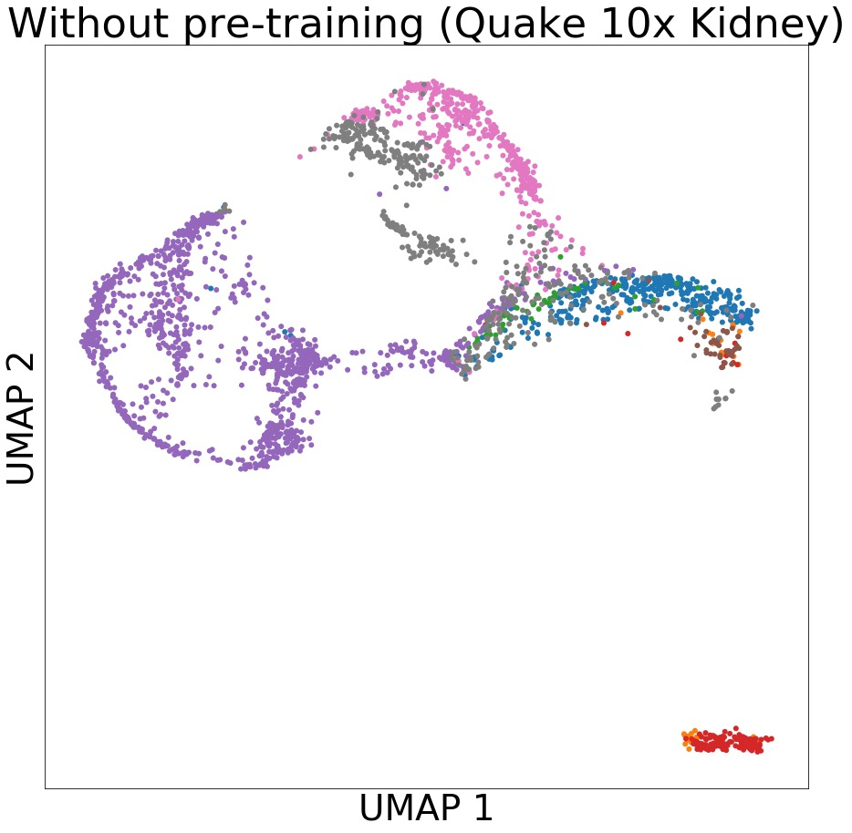

# scPretrain
 [](https://opensource.org/licenses/MIT) 

Pytorch implementation for scPretrain: Multi-task self-supervised learning for cell type classification.

# Abstract
Rapidly generated scRNA-seq datasets enable us to understand cellular differences and the function
of each individual cell at single-cell resolution. Cell type classification, which aims at characterizing
and labeling groups of cells according to their gene expression, is one of the most important steps for
single-cell analysis. To facilitate the manual curation process, supervised learning methods have been
used to automatically classify cells. Most of the existing supervised learning approaches only utilize
annotated cells in the training step while ignoring the more abundant unannotated cells. In this paper,
we proposed scPretrain, a multi-task self-supervised learning approach that jointly considers
annotated and unannotated cells for cell type classification. scPretrain consists of a pre-training step
and a fine-tuning step. In the pre-training step, scPretrain uses a multi-task learning framework to
train a feature extraction encoder based on each dataset’s pseudo-labels, where only unannotated cells
are used. In the fine-tuning step, scPretrain fine-tunes this feature extraction encoder using the limited
annotated cells in a new dataset. We evaluated scPretrain on 60 diverse datasets from different
technologies, species and organs, and obtained a significant improvement on both cell type
classification and cell clustering. Moreover, the representations obtained by scPretrain in the
pre-training step also enhanced the performance of conventional classifiers such as random forest,
logistic regression and support vector machines. scPretrain is able to effectively utilize the massive
amount of unlabelled data and be applied to annotating increasingly generated scRNA-seq datasets.

# Model Architecture
<p align='center'>

</p>

# Requirements
```
pip install -r requirements.txt
```
# Datasets
Automatically download from https://cblast.gao-lab.org/download.
inside folder: /dataset/

# Experiment

Pre-training step

Phase 1: pre-train on pseudo-labels generated by clustering on input. Output model name required by --save_model.
```console
>>> python main.py --cuda --is_pretrain --kmeans 
```

Phase 2: pre-train on pseudo-labels generated by clustering on output. Pre-trained model name required by --pretrained_model.
```console
>>> python main.py --cuda --is_pretrain --kmeans --pretrain_output
```

Fine-tuning step: automatically test on 60 datasets. Pre-trained model name required by --pretrained_model.  

```console 
>>> python main.py --cuda --kmeans 
```

Test other off-the-shelf classifiers (e.g SVM). Classifier name required by --clf.

```console
>>> python rf_svm_lr.py --clf svm 
```
Produce cluster results using scPretrain generated representations and UMAP reducer.

```console
>>> python clus.py 
```

# Figures

Create the scatter plots of Accuracy, Cohen's Kappa, AUPRC, AUROC, clustering etc. (Remember to do clustering and produce off-the-shelf classifier results first in order to create related figures)

```console
>>> python fig.py
```
Sample figures:

<p align='center'>

</p>

# Test with other datasets


